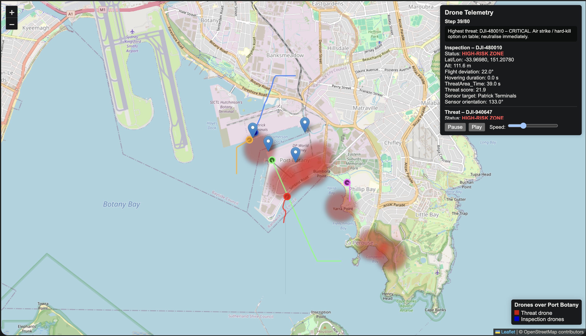

## Australian Defense Tech Hackathon 2026 - Team 5 Submission


This project was developed for the **Australian Defense Tech Hackathon**, held from February 6–8, 2026, at UNSW Canberra City (Reid).

## Challenge: UAV Threat Classification & Prediction

### Problem Description

The goal of this challenge is to create an AI-driven system capable of classifying detected drones and predicting their behavior in real time using Computer Vision & Edge AI, focusing on sUAS and Counter-sUAS technologies.

#### Requirements

* Determine each drone’s type, model, or payload (e.g., camera drone, delivery drone, custom build).
* Assess threat level by distinguishing benign drones (press, hobby) from hostile drones carrying surveillance equipment or payloads.
* Predict future trajectory or intent, providing early warning of potential attack paths.
* Operate fully autonomously with no human in the loop.

#### Context

Modern conflicts often operate in the "Grey Zone," where the line between civilian and military actors is intentionally blurred. Examples include:

* Russia's use of "little green men" in Ukraine.
* China maintaining a civilian-looking maritime fleet acting as militia.

Adversaries will deploy Commercial Off-The-Shelf (COTS) drones to blend in with normal operations at commercial ports. Visual identification alone is insufficient; the key challenge is determining the drone's intent.

#### Scenario

Australian ports are busy economic hubs with legitimate logistics and inspection drone activity.

* A Royal Australian Navy (RAN) vessel is refueling at a dual-use commercial port.
* Legitimate drones are conducting inspections of cranes and merchant ships.
* An unknown actor deploys a visually identical surveillance drone with a spoofed civilian ID.
* The drone subtly drifts its flight path and orients its sensors toward sensitive naval assets.

The system must detect micro-behaviors such as slight flight deviations, hovering duration, and sensor orientation to classify this drone as hostile before it can transmit data or initiate an attack.


## Team Dynamic

Our team, **Team 5**, participated in the Australian Defense Tech Hackathon. The team members and contributions were:

- **Anubhav Karki** – Developed this project entirely  
- **Tanmeet** – Testing of the application  
- **Phong** – Assisted in building the project  
- **Kinley** – Worked on training the AI model  
- **Datta** – Other contributions


# UAV Threat Classification & Simulation – Port Botany

This project is a comprehensive UAV (drone) simulation and threat classification system, designed to demonstrate advanced drone behavior, risk assessment, and telemetry visualization over Port Botany. The system simulates multiple inspection drones and a hostile "threat" drone, tracks their trajectories, computes metrics, and visualizes everything in an interactive Leaflet map. 



## Project Overview

The UAV Threat Classification system provides a full-stack simulation of drone operations with a focus on identifying potential threats around high-value areas. The project includes:

- **Multiple drone types**: Inspection drones performing structured inspection runs and a threat drone exhibiting erratic, hostile behavior.
- **Trajectory simulation**: Deterministic paths for inspection drones and dynamic, stochastic motion for the threat drone.
- **Behavior and risk metrics**: Calculation of hovering, flight deviation, proximity to risk zones, and sensor orientation.
- **Threat scoring**: Unified threat score combining multiple behavioral and positional factors.
- **Visualization**: Interactive HTML map with animated drone paths, heatmaps for risk areas, and live metrics display.
- **Data export**: Logs in TXT format and JSON export for threat drone telemetry.

## Features

### Drone Simulation
- **Inspection Drones**
  - Follow predefined trajectories over cranes and ships.
  - Perform inspection runs from north, south, west, and east approaches.
- **Threat Drone**
  - Exhibits erratic movement with heading corrections, speed modulation, and attraction toward high-value POIs.
  - Loitering and micro-drifts mimic realistic hostile behavior.

### Metrics and Risk Analysis
- **Hover detection**: Measures hovering duration based on movement thresholds.
- **Flight deviation**: Monitors heading changes per step.
- **Risk zones**: High-weight Points of Interest (POIs) define risk areas.
- **Sensor orientation**: Determines direction of drone sensors relative to nearest POI.
- **Threat scoring**: Integrates risk exposure, hovering, flight deviation, and sensor fixation into a single threat score.

### Visualization
- Animated Leaflet HTML map of drone positions over Port Botany.
- Risk heatmap highlighting high-value POIs.
- Interactive metrics sidebar showing per-step telemetry and threat ranking.
- Play/Pause controls and adjustable simulation speed.
- Drone polylines showing paths, dynamically reset when simulation loops.

### Logging and Export
- **TXT logs** for both drone positions and detailed metrics.
- **JSON export** of threat drone telemetry for downstream ML or analysis.

## Installation

1. Clone the repository:

```bash
git clone <YOUR_REPO_URL>
cd <YOUR_REPO_FOLDER>
```

2. Install dependencies (Python 3.10+ recommended):

```bash
pip install -r requirements.txt
```

3. Run the simulation:

```bash
python main.py
```

4. Output files generated:

* `drone_log.txt` – Position log of all drones.
* `drone_metrics.txt` – Metrics log including threat scores.
* `drone_locations.html` – Interactive Leaflet map of drone paths.
* `threat_telemetry.json` – JSON export for the threat drone.

## Project Structure

```
.
├── main.py                  # Entry point
├── simulation/
│   ├── simulator.py         # Orchestrates drones, metrics, export, map
│   ├── drone.py             # Drone dataclass
│   ├── trajectories.py      # Predefined inspection paths
│   ├── movement.py          # Threat drone movement logic
├── metrics/
│   ├── behavior.py          # Compute behavior metrics per step
│   ├── risk.py              # Risk zones and POI evaluation
│   ├── scoring.py           # Threat score computation
├── export/
│   ├── logger.py            # Logs to console and TXT files
│   ├── map_builder.py       # Leaflet map generation
│   ├── json_export.py       # Threat telemetry export
├── core/
│   ├── geo.py               # Geographic utilities
│   ├── utils.py             # ID, altitude, base time generators
├── config/
│   ├── constants.py         # Simulation constants
│   ├── port_botany.py       # Map and POI definitions
│   ├── thresholds.py        # Hover and risk thresholds
├── demo/
│   └── demo.png             # UI screenshot
```

## Demo

A live simulation demonstration is available via Google Drive:
[Live Simulation Demo](https://drive.google.com/file/d/1PJLfwVeVLP3Y8uivKmJkCtpopVtdnUlo/view?usp=sharing)

## Usage

Once the simulation is running:

* Open `drone_locations.html` in a browser.
* The sidebar shows telemetry metrics for all drones, dynamically updating per step.
* Highest threat drones are highlighted with a descriptive headline.
* The risk heatmap provides visual context of sensitive areas around Port Botany.
* Use play/pause controls and speed slider to control the animation.

## Technology Stack

* **Python 3** for simulation and metric calculations.
* **Leaflet.js** for interactive map visualization.
* **JSON & TXT** for structured telemetry export.
* **Mathematics & GIS** for geospatial calculations and risk evaluation.

## Key Highlights

* Dynamic behavior of threat drones with realistic evasion and attraction patterns.
* Integrated metrics analysis for hovering, deviation, and risk exposure.
* Interactive and animated visualization with live telemetry.
* Modular architecture separating simulation, metrics, and export logic.
* Easy-to-run Python project with minimal setup.

## License

This project is open-source and free to use under the MIT License.

## Contact

For questions or contributions, please open an issue or submit a pull request on GitHub.